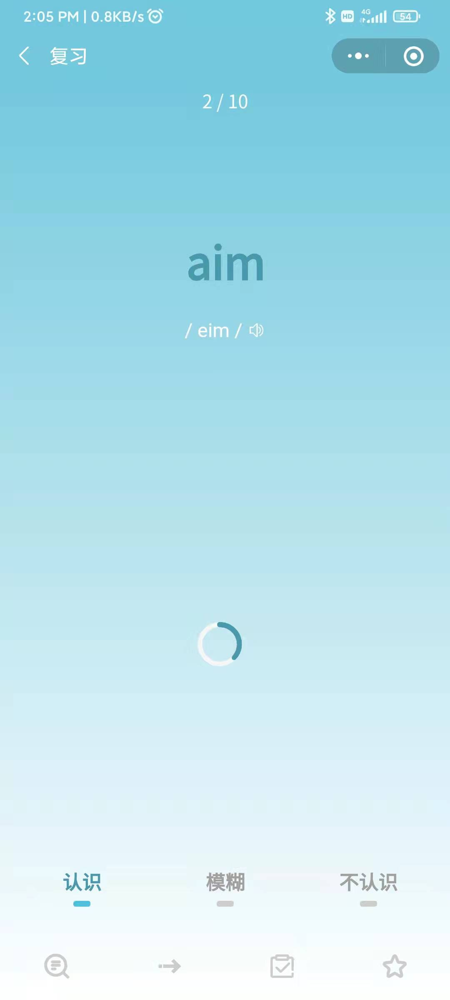
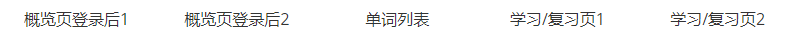
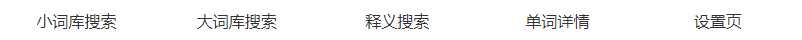

# 学不会单词

一个背单词小程序

### 词汇数据来源
[ECDICT](https://github.com/skywind3000/ECDICT)

### 简介
这是一个背单词小程序，是仿**不背单词**App做的（因为不背的UI真的太好看了），词库是刚好找到了大佬的**ECDICT**项目，把这些数据稍微做了些处理导入了数据库。
主要实现搜索，学习单词，复习单词，统计，登录等功能。

### 整体结构

### 功能模块及页面
- [x] 登录模块（支持账号密码、微信登录&注册）

- [x] 主页
    - [x] 每日一句（获取&发音）
    - [x] 主页显示需要背以及复习的量
    
- [x] 概述页
    - [x] 显示相关基础及统计数据（词书、已背数量等）
    - [x] 切换词书
    - [x] 查看所有学过/未学习的单词等各项统计的单词队列
    - [x] 收藏夹
    - [x] 每日任务
    - [x] ECharts显示历史学习记录
    
- [x] 个人主页
    - [x] 个人信息更改(头像、昵称、密码)
    
- [x] 单词详情页

- [x] 搜索模块
    - [x] 用英文搜索（前缀、搜原型、空格模糊搜索）
    - [x] 中文释义进行搜索（直接当空格模糊使，近义词替代和自动分词太难了没做）
    - [x] 历史搜索
    - [x] 切换大小词库（小的快/大的全）
    
- [x] 学习/复习单词
    - [x] 三种题型（看词选义、看词识义、看义识词）
    - [x] 遮挡单词or词义样式（倒计时自动取消or遮挡条点击取消）
    - [x] 循环逻辑及实现
    - [x] 跳过or设置为已掌握
    - [x] 复习时间间隔算法（参考SuperMemo系列SM-5算法）
    - [ ] 拼写页面
    
- [x] 设置页

### 效果图

        

        

        

        

### 更多

最近比较忙，先简单列列已完成的and放放效果图（请原谅我放那么多图），详细的介绍之后再上，持续更新ing~
